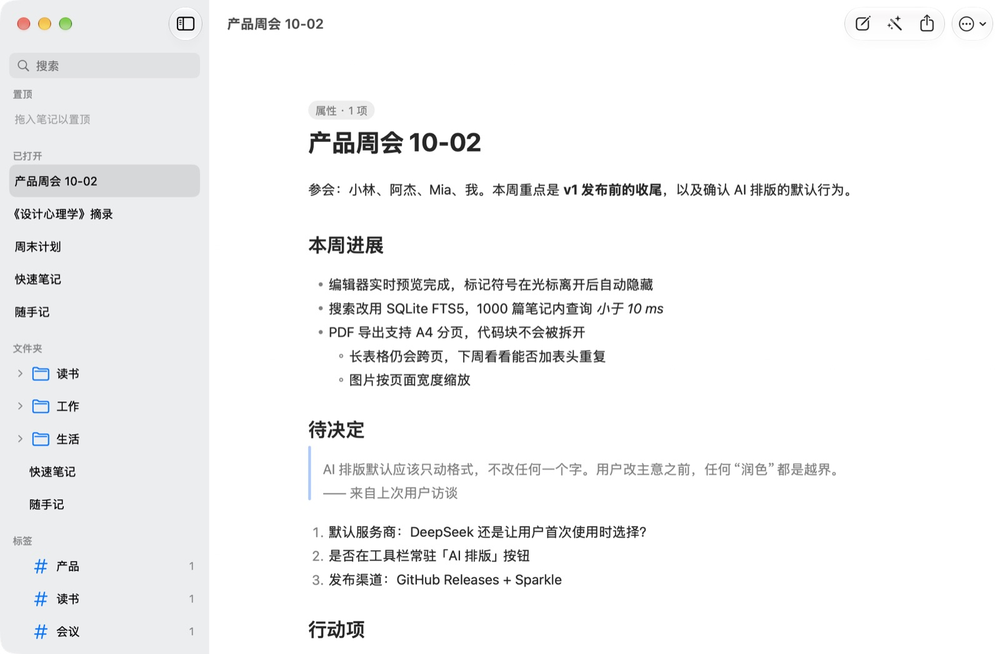
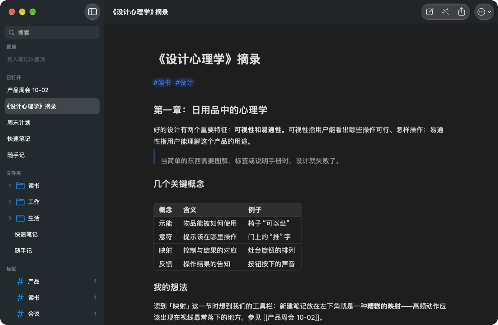

# ToastNote

原生、轻量的 macOS Markdown 笔记应用：实时渲染的编辑器，加上自带 API Key（BYOK）的 AI 一键排版（只改结构，不改措辞）。笔记就是磁盘上的普通 `.md` 文件，可以和 Obsidian、iCloud Drive、Git 共用同一个文件夹。





## 功能

- **实时渲染**：光标所在的块显示 Markdown 源码，其余块直接显示排版效果。支持标题、列表、任务、引用、代码块、表格、图片、标签、frontmatter。
- **AI 一键排版**（⌘⇧L）：只调整结构（标题、段落、列表、强调、表格），不改一个字。结果在左右对照的审阅窗口里确认后才写入，可以 ⌘Z 撤销；如果 AI 动了文字，会标出可能被改的句子。
- **笔记库就是文件夹**：外部修改即时同步；粘贴或拖入的图片存到 `attachments/`。
- **快速打开**（⌘P）、**全文搜索**（⌘⇧F，中文也能搜）、**标签**（支持 `#父/子` 层级）。
- **标签页、置顶、专注模式**，以及 A4 分页的 **PDF 导出**（⌘⇧E）。
- 深浅色、跟随系统强调色，支持“增强对比度”和“减弱动态效果”。

## 配置 AI（以 DeepSeek 为例）

1. 在 [DeepSeek 开放平台](https://platform.deepseek.com/) 创建 API Key。
2. 打开 ToastNote → 设置（⌘,）→ AI，选中 **DeepSeek**，把 Key 粘贴到“API Key”。Key 只保存在 macOS 钥匙串里。
3. 点“测试连接”，显示“成功”即可。
4. 打开一篇笔记，点工具栏的魔杖按钮或按 ⌘⇧L。

也可以选 Anthropic、OpenAI、OpenRouter、本地 Ollama，或用“+”添加任何 OpenAI 兼容的服务。“额外要求”里的文字会追加到提示词末尾，例如“列表一律用 -”。

## 构建

需要 macOS 14+、Xcode 和 [XcodeGen](https://github.com/yonaskolb/XcodeGen)（`brew install xcodegen`）。

```bash
# 运行测试
swift test --package-path Packages/ToastNoteKit

# 生成工程并构建
xcodegen generate
xcodebuild -project ToastNote.xcodeproj -scheme ToastNote -configuration Debug -destination 'platform=macOS' build

# 打包 DMG（见 docs/RELEASING.md）
bash scripts/build-dmg.sh
```

生成 1000 篇笔记的测试库：`bash scripts/make-test-vault.sh /tmp/tn-vault 1000`。应用图标由 `swift scripts/make-app-icon.swift App/Resources/Assets.xcassets/AppIcon.appiconset` 生成。

设计规格见 `docs/superpowers/specs/`，实现计划见 `docs/superpowers/plans/`，性能记录见 `docs/perf-log.md`。

## 未签名构建

目前的构建没有 Apple 开发者账号签名与公证。首次打开时请在 Finder 中右键点击 ToastNote.app，选择“打开”。

## 许可证

MIT
